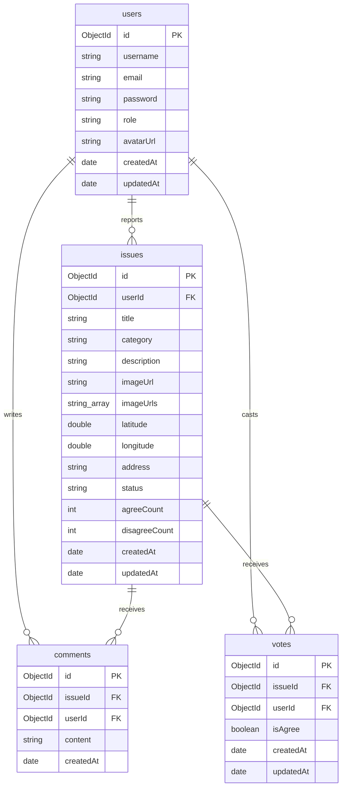
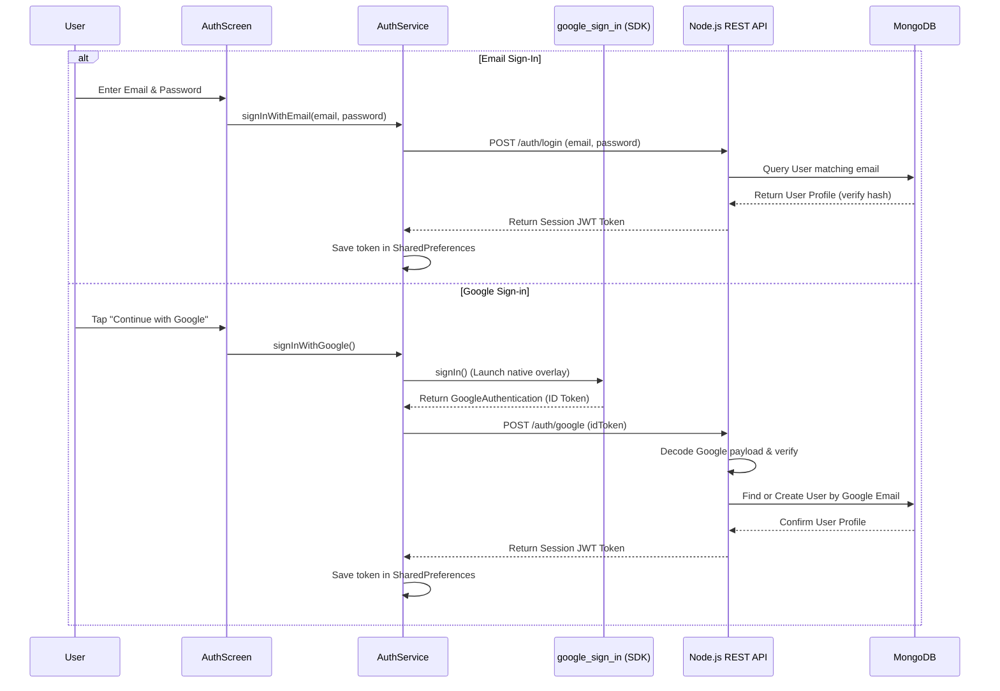
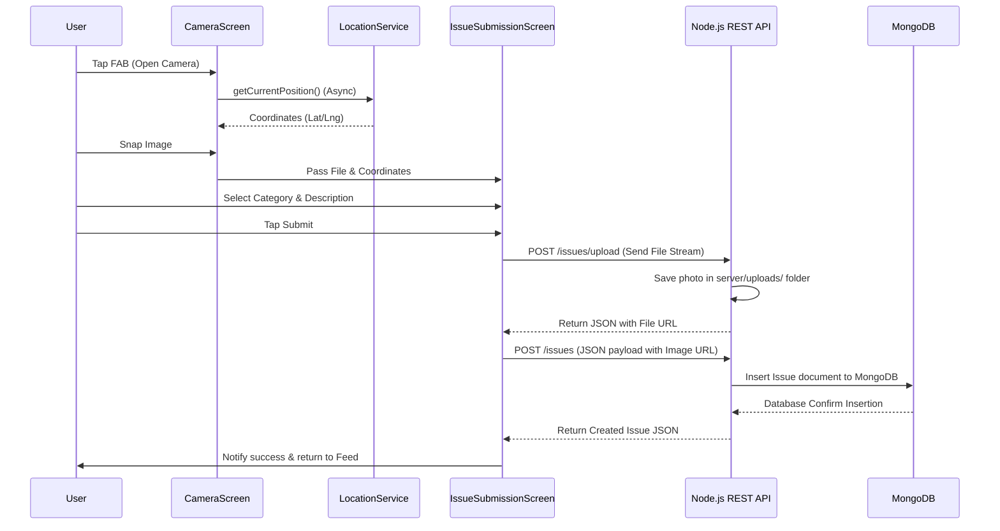

# Civic Connect: Comprehensive Project Report (MongoDB Migration Edition)

This document serves as an updated, exhaustive report detailing all aspects of the **Civic Connect** mobile application, migrated from Supabase to a custom **Node.js/Express + MongoDB** backend.

---

## 1. Executive Summary & Project Goals

### Overview
**Civic Connect** is a location-aware mobile application built on Flutter (Frontend Client) and a Node.js/Express REST server (Backend API) querying a MongoDB database. Its main purpose is to enable local citizens to report, map, and democratically validate municipal issues such as:
- **Potholes & Road Damage**
- **Broken Street Lights**
- **Garbage Pile-ups**
- **Water & Electricity Supply Disruptions**
- **Drainage issues**

### Key Objectives
1. **Reduce Friction in Reporting**: Allow citizens to capture photos and submit complaints immediately with automated location pinpointing.
2. **Community Validation (Democratic Verification)**: Prevent fake or duplicate complaints by allowing the community to vote ("Agree" or "Disagree") on reported issues.
3. **Transparency**: Enable tracking of reported issues through status changes (`Pending`, `In Progress`, `Resolved`, `Rejected`).
4. **Accountability Against a Clock**: Hold every complaint to a response deadline derived from its category (`SlaPolicy`), surface overdue work first in the officer's queue, and show the same countdown to citizens that officers see.

---

## 2. High-Level Technical Stack

The application leverage the following technologies:
- **Client Framework**: [Flutter](https://flutter.dev/) (SDK `3.35.3`, target Dart `3.9.2`) utilizing Material 3.
- **Backend API**: [Node.js & Express](https://expressjs.com/) with Multer for binary image handling and jsonwebtoken/bcryptjs for auth security.
- **Database**: [MongoDB](https://www.mongodb.com/) via Mongoose ODM.
- **Client State Management**: [Provider](https://pub.dev/packages/provider) for reactive state propagation and global model handling.
- **Location & Sensors**:
  - [Geolocator](https://pub.dev/packages/geolocator) for precise GPS coordinate tracking.
  - [Geocoding](https://pub.dev/packages/geocoding) for reverse-geocoding coordinates to street addresses.
  - [Camera](https://pub.dev/packages/camera) for capturing snapshots of municipal issues.
- **OAuth & Utilities**:
  - [Google Sign-In](https://pub.dev/packages/google_sign_in) for native identity tokens.
  - [App Links](https://pub.dev/packages/app_links) for handling web and URI deep linking redirect callback streams.
  - [Cached Network Image](https://pub.dev/packages/cached_network_image) for performance-focused image display.

---

## 3. Directory & File-by-File Breakdown

Below is a detailed walkthrough of all implementation files.

### Client-Side Root & Models (`lib/`)
- **[main.dart](../../lib/main.dart)**:
  - Initializes widget bindings and loads environment variables from the parent `.env`.
  - Configures the REST services and initializes `DeepLinkService`.
  - Supplies the global `AppProvider` to the widget tree using `ChangeNotifierProvider` to prevent startup exceptions.
- **[user_profile.dart](../../lib/models/user_profile.dart)**:
  - Maps user account details (`id`, `username`, `email`, `role`, `avatarUrl`, `createdAt`).
- **[issue.dart](../../lib/models/issue.dart)**:
  - Maps reported complaints. Holds coordinate parameters, image URLs, address strings, vote counts, status states, and user vote info.

### Client-Side Providers & Services
- **[app_provider.dart](../../lib/providers/app_provider.dart)**:
  - The central coordinator of the app's global state (currentUser, nearbyIssues, userIssues).
- **[api_client.dart](../../lib/services/api_client.dart)**:
  - Generic HTTP client wrapping headers, JWT authentication token loading from `SharedPreferences`, and multipart file uploading.
- **[auth_service.dart](../../lib/services/auth_service.dart)**:
  - Connects to `/auth/login`, `/auth/signup`, `/auth/profile`, and `/auth/google`.
- **[issue_service.dart](../../lib/services/issue_service.dart)**:
  - Queries `/issues/nearby`, `/issues/user`, and `/issues/:id/vote`.
- **[comment_service.dart](../../lib/services/comment_service.dart)**:
  - Queries `/comments/issue/:id` CRUD routes.
- **[admin_service.dart](../../lib/services/admin_service.dart)**:
  - Provides REST methods for municipal officers, including `getStats()`, `getQueue()`, and `updateStatus()`.


### Server-Side Files (`server/`)
- **[server.js](../../server/server.js)**:
  - Express application entrypoint. Configures CORS, parses JSON payloads, serves the `/uploads` folder statically, and registers API routers. Loads the unified `.env` file from the parent directory.
- **[db.js](../../server/config/db.js)**:
  - Establishes connection to MongoDB via Mongoose ODM.
- **[auth.js](../../server/middleware/auth.js)**:
  - Verification middleware extracting JWT tokens from request headers and attaching decoded user objects.
- **[User.js](../../server/models/User.js)**:
  - User model schema mapping fields: `username`, `email` (unique), hashed `password`, and enum `role` ('user', 'admin').
- **[Issue.js](../../server/models/Issue.js)**:
  - Complaint report schema mapping fields: `userId`, coordinates, address, and status. Indexed for geolocated proximity searches.
- **[Comment.js](../../server/models/Comment.js)**:
  - Stores replies linking issue IDs and user IDs.
- **[Vote.js](../../server/models/Vote.js)**:
  - Stores Agree/Disagree verification votes. Constrained to one vote per user per issue via compound indexes.

---

## 4. Database Schema Specifications

The MongoDB database schema is structured as follows:



### Constraints & Security
1. **Token Verification**: Database write actions (issues, comments, votes) are blocked unless the request contains a valid JWT token matching a user in the database.
2. **Compound Unique Indexes**: MongoDB indexes prevent double-voting on `/vote` or `/upvote` endpoints.

---

## 5. Key System Workflows

### Authentication Flow (Email & Google Sign-In)


### Issue Reporting Workflow


---

## 6. Unified Environment Variable Configurations

A single `.env` file located at the project root maps both the backend and frontend configurations:

```ini
# Client settings
API_BASE_URL=http://10.0.2.2:5000/api

# Server settings
PORT=5000
MONGO_URI=mongodb://localhost:27017/civic_connect
JWT_SECRET=super_secret_jwt_key_civic_connect_123
API_URL=http://localhost:5000
```
This design avoids multiple conflicting config files across the workspace.
