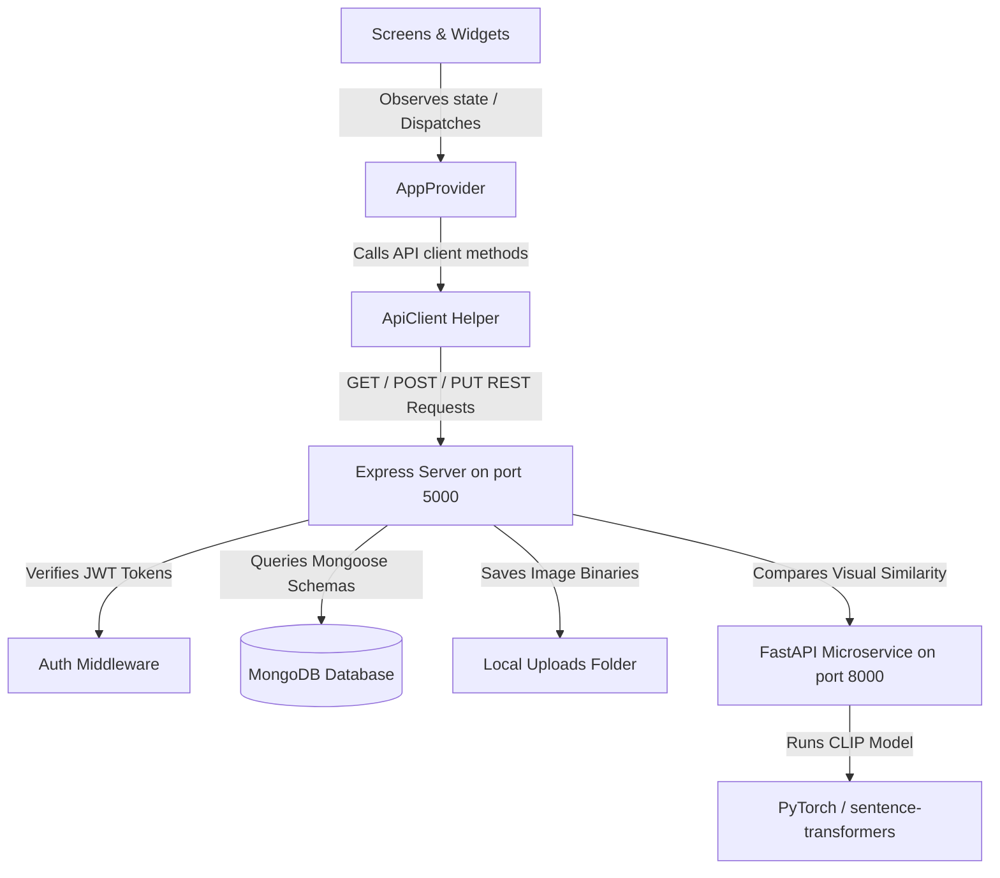
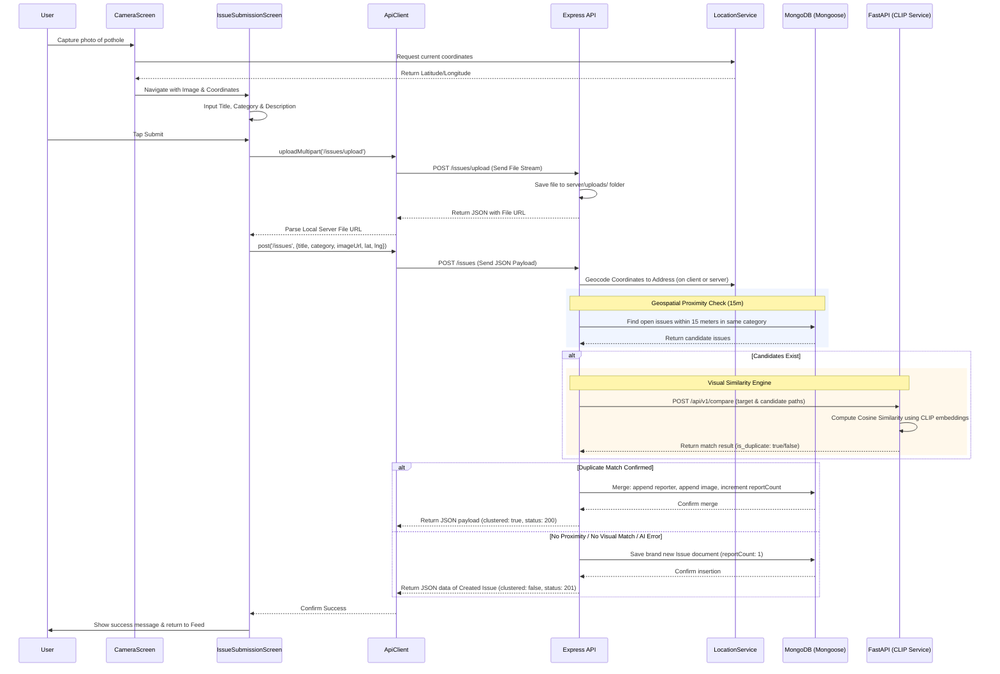

# Civic Connect: Architectural Overview

This document outlines the software architecture and directory structure of the **Civic Connect** application, utilizing a Node.js/Express + MongoDB backend API.

## Directory Structure

The project separates frontend client views from backend database operations using a modular REST architecture.

```
├── server/              # Node.js Express & MongoDB Backend
│   ├── config/          # MongoDB db.js connection configuration
│   ├── controllers/     # Controller layer (issueController.js)
│   ├── middleware/      # jwt auth.js verification middleware
│   ├── models/          # Mongoose Schemas (User.js, Issue.js, Comment.js, etc.)
│   ├── routes/          # Express route controllers (auth.js, issues.js, comments.js)
│   ├── uploads/         # Server folder storing uploaded image binaries
│   ├── .env             # Server configurations
│   ├── run-ai.js        # Helper script for running AI venv concurrently
│   └── server.js        # Main Express application entrypoint
├── ai_service/          # Python FastAPI Vision Microservice
│   ├── main.py          # FastAPI server entrypoint (CLIP model comparison)
│   ├── requirements.txt # Python dependencies
│   └── README.md        # Dedicated FastAPI readme
└── lib/                 # Flutter Mobile Client Source
    ├── models/          # Dart models matching backend JSON structures
    ├── providers/       # AppProvider — global state
    ├── screens/         # Flutter UI pages
    ├── services/        # Flutter REST API client service layer
    ├── theme/           # Municipal Navy: colours, typography, ThemeData
    ├── utils/           # SLA policy, complaint references, category taxonomy
    └── widgets/         # Reusable layouts and custom views
```

---

## Architectural Pattern

Civic Connect implements a client-server architecture with an decoupled **AI Microservice** for deep learning operations. All requests flow through Node.js Express, which communicates with MongoDB and queries the FastAPI service for vision deduplication checks:



### 1. Client Presentation Layer (UI)
Consists of Screens (views representing full screens) and Widgets (reusable layout components). The views are kept as dumb as possible, delegating actions to [AppProvider](../lib/providers/app_provider.dart) and displaying state values.

### 2. Client State Management (Provider)
[AppProvider](../lib/providers/app_provider.dart) uses Flutter's `ChangeNotifier` to hold the application's global state:
- Current authenticated user (`currentUser` of type `UserProfile`)
- Current user GPS location (`currentPosition` and `currentAddress`)
- Lists of reported issues (`nearbyIssues` and `userIssues`)
- Loading indicators and feedback states

The UI listens to this provider using `context.watch<AppProvider>()` or `Provider.of<AppProvider>(context)` and updates reactively.

### 3. Client REST Service Layer
Services encapsulate HTTP REST endpoints and platform functions:
- [ApiClient](../lib/services/api_client.dart): Generic HTTP client wrapping headers, JWT authentication token loading, and multipart requests.
- [AuthService](../lib/services/auth_service.dart): Connects to `/auth/login`, `/auth/signup`, and `/auth/profile`.
- [IssueService](../lib/services/issue_service.dart): Queries `/issues/nearby`, `/issues/user`, and `/issues/:id/vote`.
- [CommentService](../lib/services/comment_service.dart): Queries `/comments/issue/:id` CRUD routes.
- [LocationService](../lib/services/location_service.dart): Fetches GPS coordinates and translates them into street addresses using geocoding.
- [DeepLinkService](../lib/services/deep_link_service.dart): Captures URL deep links for post-OAuth redirect callbacks.

---

## Technical Flow Diagram

The following sequence diagram describes reporting a civic issue with automated proximity checking and image clustering (deduplication):



