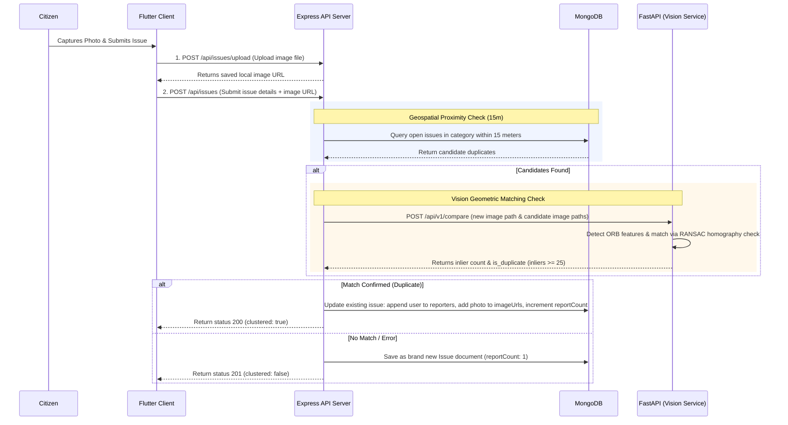

# Civic Connect: Clustering Engine & Automated Deduplication Pipeline

This document details the design, implementation, and setup instructions for the **Automated Proximity Deduplication and Image Clustering Pipeline** added to the **Civic Connect** project.

---

## 1. System Architecture & Workflow

When a citizen files a new municipal complaint (e.g. road damage, garbage piles) containing coordinates and image proof:



---

## 2. Implemented Backend Components

### 2.1 Mongoose Schema Updates (`server/models/Issue.js`)
Refactored [Issue.js](../server/models/Issue.js) to support multiple reporters, multiple images per cluster, and GeoJSON indexing:
- Added `reporters` array of `ObjectId` referencing the `User` model.
- Added `imageUrls` array of strings to store photos from different reporters.
- Added `reportCount` counter to amplify issue priority dynamically.
- Defined a `2dsphere` index on the `location` field (`[longitude, latitude]`) for fast proximity queries.
- Retained original fields (`userId`, `imageUrl`, `latitude`, `longitude`, `statusHistory`) and implemented a pre-validation hook to ensure strict backward compatibility for legacy API routes and clients.

### 2.2 Express controller (`server/controllers/issueController.js`)
Created the controller file [issueController.js](../server/controllers/issueController.js) containing:
1. **Fallback Upload Resolver:** Extracts path information regardless of whether the file was uploaded directly via multipart form or pre-uploaded via the `/upload` endpoint.
2. **Proximity Search:** Uses MongoDB `$nearSphere` and `$maxDistance` (15 meters) to query active `Pending` or `In Progress` issues.
3. **AI Comparison Call:** Dispatches candidate images and the new image to the FastAPI microservice.
4. **Cluster Resolution:** Performs atomic updates to existing issues (duplicates) or creates a new issue document with calculated SLA due dates.

### 2.3 Express Route Mapping (`server/routes/issues.js`)
Modified [issues.js](../server/routes/issues.js):
- Replaced the inline `POST /` handler with `issueController.createIssue`.
- Updated `serializeIssue` to include the `report_count` key in the response payload.
- Added `axios` to dependencies in `package.json`.

---

## 3. Python FastAPI Vision Microservice

The vision service performs scale-standardized Local Keypoint Matching using OpenCV:
1. **Scale Standardization:** Normalizes the input images to a standard width (600px) to ensure consistency in feature density.
2. **ORB Feature Detection:** Extracts up to 1500 keypoints and descriptor vectors representing distinct corners, cracks, and physical textures.
3. **Cross-Check Hamming Distance Matching:** Pairs descriptors from both images via Brute-Force matching with mutual consistency check.
4. **RANSAC Geometric Verification:** Computes the homography projection matrix between matching points. Outliers that do not map to the same physical plane are discarded. The sum of remaining inliers determines duplicate alignment.
5. **Transitive Clustering Check:** The microservice evaluates the new image against all photos associated with existing issues in the geospatial cluster, ensuring a transitive match if any image within the cluster aligns above the threshold.

* **Microservice Entrypoint:** [main.py](../ai_service/main.py)
* **Dependency Checklist:** [requirements.txt](../ai_service/requirements.txt) (`fastapi`, `uvicorn`, `pydantic`, `opencv-python`, `numpy`)
* **Similarity Metric:** Physically verified inlier count (default threshold >= 25 inliers) instead of a neural network's semantic vector.

---

## 4. Environment Configuration

Added `AI_SERVICE_URL` to [`.env`](../.env):
```ini
AI_SERVICE_URL=http://localhost:8000
```

---

## 5. Flutter Client-Side Updates

1. **Issue Model:** Added `reportCount` property to the [issue.dart](../lib/models/issue.dart) Dart model class, mapping `report_count` from JSON.
2. **Feed Card UI:** Updated the `IssueCard` widget in [issue_card.dart](../lib/widgets/issue_card.dart):
   * Displays a **multi-photo stack icon badge** in the top-right corner if the issue contains multiple images.
   * Displays a **community priority chip** (`X reports`) at the bottom of the card to indicate duplicate complaints merged into this cluster.
3. **Detail Screen UI:** Updated `IssueDetailScreen` in [issue_detail_screen.dart](../lib/screens/issue_detail_screen.dart):
   * Upgraded the evidence header to an **interactive PageView slider** with page indicator dots and a text counter (`1/X`) when multiple photos are present.
   * Added an **alerts/info banner** explaining that the issue has been merged from multiple citizen reports to amplify community priority.

---

## 6. How to Run & Verify

### Step 1: Set up the Python FastAPI Microservice dependencies
Open a terminal in the project root:
```bash
# Navigate to the AI service folder and set up dependencies
cd ai_service
python -m venv venv
venv\Scripts\activate   # On Windows
source venv/bin/activate # On Unix/macOS
pip install -r requirements.txt
```

### Step 2: Start the Servers
You can run the Express API backend and the Python FastAPI similarity service concurrently from the `server` directory:
```bash
cd server
npm install
npm run dev
```

Alternatively, you can run them in separate terminals:

**Run Express Server only:**
```bash
cd server
npm start
```

**Run Python AI service only:**
```bash
cd ai_service
uvicorn main:app --host 0.0.0.0 --port 8000 --reload
```

Run `npm test` to verify the backend integration test suite.

### Step 3: Run the Flutter Client
```bash
flutter run
```
Both `flutter analyze` and backend unit/integration tests run green with no compilation warnings or errors.
