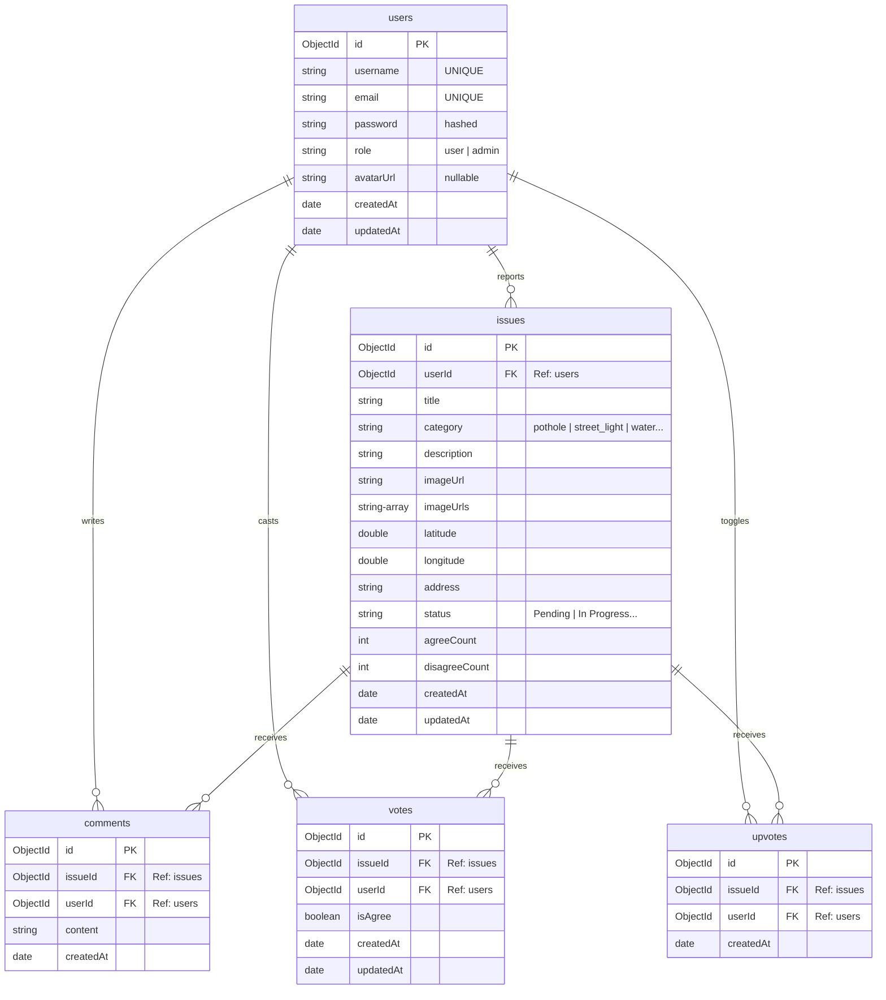

# Civic Connect: MongoDB Database Schema

This document details the database schema, collection properties, references, and indexes configured in MongoDB using the Mongoose ODM for **Civic Connect**.

---

## Entity Schema Mapping

Since MongoDB is a document-oriented database, relations are maintained using Reference Objects (`mongoose.Schema.Types.ObjectId` referencing specific collections):

---

## Collection Schemas

### 1. `users` collection
Maps authentication profiles. Exposes user access roles.
- `username` (String, Required, Unique, Trimmed)
- `email` (String, Required, Unique, Lowercase, Trimmed)
- `password` (String, Required, Hashed via bcryptjs)
- `role` (String, Enum: `['user', 'admin']`, Default: `'user'`)
- `avatarUrl` (String, Default: `null`)
- `createdAt` (Date, Default: `Date.now`)
- `updatedAt` (Date, Default: `Date.now`)

### 2. `issues` collection
Represents municipal complaints reported by users.
- `userId` (ObjectId, Reference: `'User'`, Required)
- `title` (String, Required, Trimmed)
- `category` (String, Required, Enum: `['pothole', 'street_light', 'water', 'electricity', 'garbage', 'road', 'drainage', 'other']`)
- `description` (String, Default: `''`)
- `imageUrl` (String, Required, holds link to main picture)
- `imageUrls` (Array of Strings, holds all supporting photo paths)
- `latitude` (Number, Required)
- `longitude` (Number, Required)
- `address` (String, Default: `''`, resolved via geocoding)
- `status` (String, Enum: `['Pending', 'In Progress', 'Resolved', 'Rejected']`, Default: `'Pending'`)
- `agreeCount` (Number, Default: `0`, automatically synchronized on vote cast)
- `disagreeCount` (Number, Default: `0`)
- `createdAt` (Date, Default: `Date.now`)
- `updatedAt` (Date, Default: `Date.now`)

### 3. `comments` collection
Holds discussion replies posted underneath issues.
- `issueId` (ObjectId, Reference: `'Issue'`, Required)
- `userId` (ObjectId, Reference: `'User'`, Required)
- `content` (String, Required, Trimmed)
- `createdAt` (Date, Default: `Date.now`)

### 4. `votes` collection
Manages the validation voting mechanism (Agree vs. Disagree).
- `issueId` (ObjectId, Reference: `'Issue'`, Required)
- `userId` (ObjectId, Reference: `'User'`, Required)
- `isAgree` (Boolean, Required)
- `createdAt` (Date, Default: `Date.now`)
- `updatedAt` (Date, Default: `Date.now`)

### 5. `upvotes` collection
Manages legacy upvotes.
- `issueId` (ObjectId, Reference: `'Issue'`, Required)
- `userId` (ObjectId, Reference: `'User'`, Required)
- `createdAt` (Date, Default: `Date.now`)

---

## Database Indexes

MongoDB collections are indexed to ensure queries are highly performant:

1. **`users` indexes**:
   - `{ email: 1 }` (Unique) - Prevents register collisions on duplicate email.
   - `{ username: 1 }` (Unique) - Prevents register collisions on duplicate username.
2. **`issues` indexes**:
   - `{ latitude: 1, longitude: 1 }` (Geospatial lookup) - Essential for coordinate calculations in nearby proximity queries.
3. **`votes` indexes**:
   - `{ issueId: 1, userId: 1 }` (Unique) - Enforces that a profile can cast at most **one** Agree/Disagree vote per reported issue.
4. **`upvotes` indexes**:
   - `{ issueId: 1, userId: 1 }` (Unique) - Enforces that a profile can toggle at most **one** legacy upvote per reported issue.
