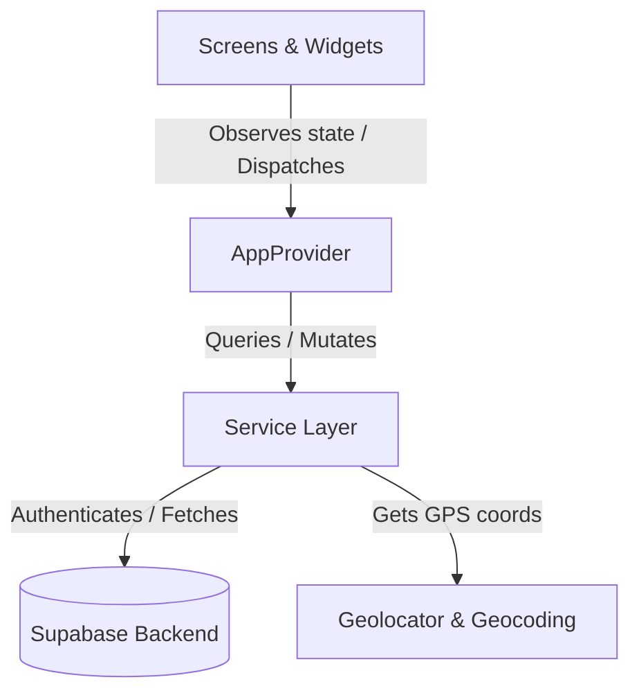
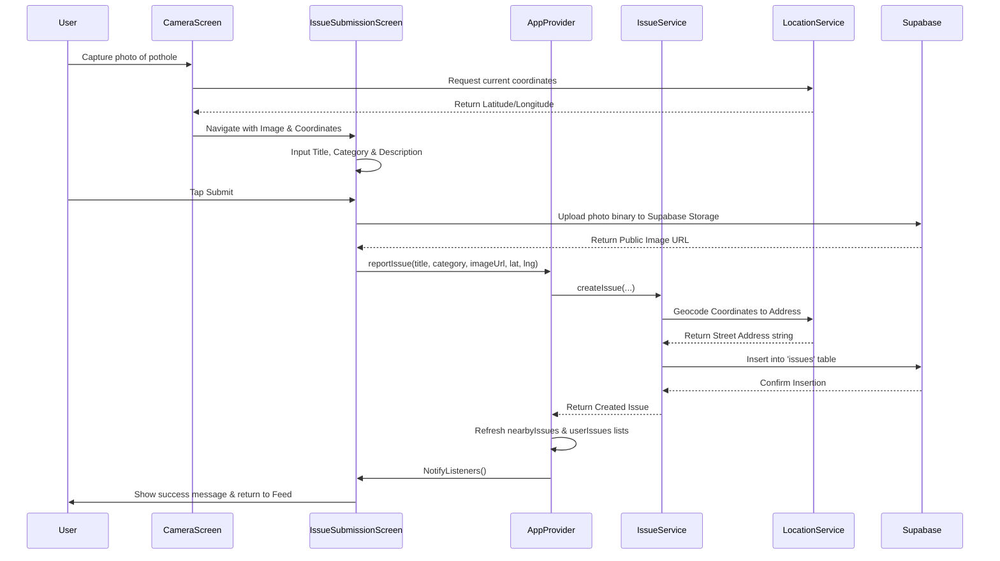

# Civic Connect: Architectural Overview

This document outlines the software architecture and directory structure of the **Civic Connect** Flutter application.

## Directory Structure

The project follows a modular and layer-separated structure for scalability, readability, and ease of testing.

```
lib/
├── config/              # App configuration (currently placeholder/empty)
├── models/              # Data model classes mapping JSON objects
│   ├── comment.dart
│   ├── issue.dart
│   ├── models.dart      # Exports all models
│   ├── user_profile.dart
│   └── vote.dart
├── providers/           # State management using the Provider package
│   └── app_provider.dart
├── screens/             # Interactive UI views
│   ├── auth_screen.dart
│   ├── camera_screen.dart
│   ├── feed_screen.dart
│   ├── home_screen.dart
│   ├── issue_detail_screen.dart
│   ├── issue_submission_screen.dart
│   └── profile_screen.dart
├── services/            # Infrastructure logic and Supabase endpoints
│   ├── auth_service.dart
│   ├── comment_service.dart
│   ├── deep_link_service.dart
│   ├── issue_service.dart
│   ├── location_service.dart
│   └── upvote_service.dart
├── widgets/             # Reusable UI widgets
│   ├── UpvoteButton.dart
│   ├── auth_wrapper.dart
│   ├── comment_tile.dart
│   └── issue_card.dart
├── main.dart            # App entry point and bootstrapper
└── service_locator.dart # Service registry for dependency injection
```

---

## Architectural Pattern

Civic Connect uses a **Service-Provider-UI** pattern, similar to MVVM (Model-View-ViewModel), separating the business logic and API integrations from UI controllers.



### 1. Presentation Layer (UI)
Consists of Screens (views representing full screens) and Widgets (reusable layout components). The views are kept as dumb as possible, delegating actions to [AppProvider](file:///E:/CODES/Mobile_Dev/Flutter/Civic_Connect/lib/providers/app_provider.dart) and displaying state values.

### 2. State Management (Provider)
[AppProvider](file:///E:/CODES/Mobile_Dev/Flutter/Civic_Connect/lib/providers/app_provider.dart) uses Flutter's `ChangeNotifier` to hold the application's global state:
- Current authenticated user (`currentUser` of type `UserProfile`)
- Current user GPS location (`currentPosition` and `currentAddress`)
- Lists of reported issues (`nearbyIssues` and `userIssues`)
- Loading indicators and feedback states

The UI listens to this provider using `context.watch<AppProvider>()` or `Provider.of<AppProvider>(context)` and updates reactively.

### 3. Service Layer
Services encapsulate interactions with external APIs, system sensors, or native devices:
- [AuthService](file:///E:/CODES/Mobile_Dev/Flutter/Civic_Connect/lib/services/auth_service.dart): Authenticates via Supabase Auth (supports Email/Password and Google Sign-in) and manages user profile queries.
- [IssueService](file:///E:/CODES/Mobile_Dev/Flutter/Civic_Connect/lib/services/issue_service.dart): Performs database CRUD on issues, spatial queries using RPC, upvotes, and details fetching.
- [CommentService](file:///E:/CODES/Mobile_Dev/Flutter/Civic_Connect/lib/services/comment_service.dart): CRUD operations on comments.
- [LocationService](file:///E:/CODES/Mobile_Dev/Flutter/Civic_Connect/lib/services/location_service.dart): Fetches GPS coordinates and translates them into street addresses using geocoding.
- [DeepLinkService](file:///E:/CODES/Mobile_Dev/Flutter/Civic_Connect/lib/services/deep_link_service.dart): Captures URL deep links for post-OAuth redirect callbacks.

### 4. Dependency Injection
[ServiceLocator](file:///E:/CODES/Mobile_Dev/Flutter/Civic_Connect/lib/service_locator.dart) acts as a registry to access services without manual instantiations in every class. It supplies singletons for services like `AuthService` and `CommentService`.

---

## Technical Flow Diagram

The following sequence diagram describes reporting a civic issue with location-aware data:


