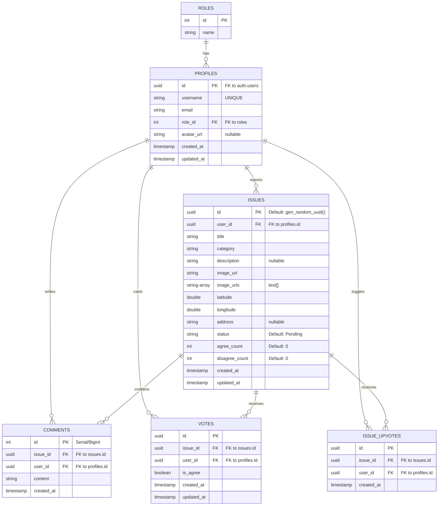

# Civic Connect: Database Schema

This document details the database schema, tables, constraints, and relationships configured in Supabase (PostgreSQL) for **Civic Connect**.

---

## ER Diagram (Entity-Relationship)

---

## Tables

### 1. `roles`
Stores access levels (e.g., standard users and administrators).
- `id` (INTEGER, Primary Key)
- `name` (TEXT, e.g. `'user'`, `'admin'`)

### 2. `profiles`
Extends Supabase's native auth configuration. Usually created via a PostgreSQL trigger on user sign-up.
- `id` (UUID, Primary Key, Foreign Key referencing `auth.users.id` ON DELETE CASCADE)
- `username` (TEXT, Unique, non-null)
- `email` (TEXT, non-null)
- `role_id` (INTEGER, Foreign Key referencing `roles.id`, typically defaults to `1` for standard users)
- `avatar_url` (TEXT, Nullable, points to user avatar in Storage)
- `created_at` (TIMESTAMPTZ, Default: `now()`)
- `updated_at` (TIMESTAMPTZ)

### 3. `issues`
Represents the core civic complaints reported by citizens.
- `id` (UUID, Primary Key, Default: `gen_random_uuid()`)
- `user_id` (UUID, Foreign Key referencing `profiles.id` ON DELETE SET NULL)
- `title` (TEXT, summary of issue)
- `category` (TEXT, types of issues: `'pothole'`, `'street_light'`, `'water'`, `'electricity'`, `'garbage'`, `'road'`, `'drainage'`, `'other'`)
- `description` (TEXT, Nullable)
- `image_url` (TEXT, URL of primary captured image)
- `image_urls` (TEXT ARRAY / `text[]`, stores additional images uploaded during reporting)
- `latitude` (DOUBLE PRECISION)
- `longitude` (DOUBLE PRECISION)
- `address` (TEXT, Nullable, holds the geocoded address string)
- `status` (TEXT, Default: `'Pending'`, values: `'Pending'`, `'In Progress'`, `'Resolved'`, `'Rejected'`)
- `agree_count` (INTEGER, Default: `0`, incremented by database trigger or service sync on upvote/agree)
- `disagree_count` (INTEGER, Default: `0`)
- `created_at` (TIMESTAMPTZ, Default: `now()`)
- `updated_at` (TIMESTAMPTZ)

### 4. `comments`
Comments section underneath reported issues.
- `id` (BIGINT/SERIAL, Primary Key)
- `issue_id` (UUID, Foreign Key referencing `issues.id` ON DELETE CASCADE)
- `user_id` (UUID, Foreign Key referencing `profiles.id` ON DELETE CASCADE)
- `content` (TEXT, non-empty text)
- `created_at` (TIMESTAMPTZ, Default: `now()`)

### 5. `votes` (Agree/Disagree Voting Mechanism)
Handles binary opinion validation (Agree/Disagree) to verify if the reported issue is actual or duplicated.
- `id` (UUID, Primary Key, Default: `gen_random_uuid()`)
- `issue_id` (UUID, Foreign Key referencing `issues.id` ON DELETE CASCADE)
- `user_id` (UUID, Foreign Key referencing `profiles.id` ON DELETE CASCADE)
- `is_agree` (BOOLEAN, `true` for Agree, `false` for Disagree)
- `created_at` (TIMESTAMPTZ, Default: `now()`)
- `updated_at` (TIMESTAMPTZ)
- *Constraint*: Unique combination of `(issue_id, user_id)` preventing duplicate voting.

### 6. `issue_upvotes` (Simple Toggle Upvote Mechanism)
A secondary/legacy upvote count table.
- `id` (UUID, Primary Key, Default: `gen_random_uuid()`)
- `issue_id` (UUID, Foreign Key referencing `issues.id` ON DELETE CASCADE)
- `user_id` (UUID, Foreign Key referencing `profiles.id` ON DELETE CASCADE)
- `created_at` (TIMESTAMPTZ, Default: `now()`)
- *Constraint*: Unique combination of `(issue_id, user_id)`.

> [!NOTE]
> **Dual Voting System**: The codebase contains two systems for validating issues:
> 1. An **Agree/Disagree system** managed by `votes` table which increases `agree_count` / `disagree_count` columns directly on the `issues` table. Used in [issue_card.dart](file:///E:/CODES/Mobile_Dev/Flutter/Civic_Connect/lib/widgets/issue_card.dart).
> 2. A **Simple Upvote system** managed by `issue_upvotes` table which is toggled via `UpvoteService`. Used in [UpvoteButton.dart](file:///E:/CODES/Mobile_Dev/Flutter/Civic_Connect/lib/widgets/UpvoteButton.dart) and [issue_submission_screen.dart](file:///E:/CODES/Mobile_Dev/Flutter/Civic_Connect/lib/screens/issue_submission_screen.dart).

---

## Stored Procedures (RPCs) and Functions

### 1. `get_nearby_issues`
A PL/pgSQL function used to fetch issues within a given radius using coordinate distance calculation.
- **Parameters**:
  - `lat` (DOUBLE PRECISION): Target Latitude
  - `lng` (DOUBLE PRECISION): Target Longitude
  - `radius_km` (DOUBLE PRECISION): Radius boundary
  - `max_count` (INTEGER): Row limit
- **Returns**: `SETOF issues` table rows within the radius.

### 2. `get_issue_votes`
Aggregates votes count for a specific issue.
- **Parameters**:
  - `p_issue_id` (UUID)
- **Returns**: A JSON or table row containing `agree_count` and `disagree_count`.

### 3. `get_issue_upvotes`
Aggregates total upvotes from the `issue_upvotes` table.
- **Parameters**:
  - `issue_uuid` (UUID)
- **Returns**: `INTEGER` sum of upvote rows.
